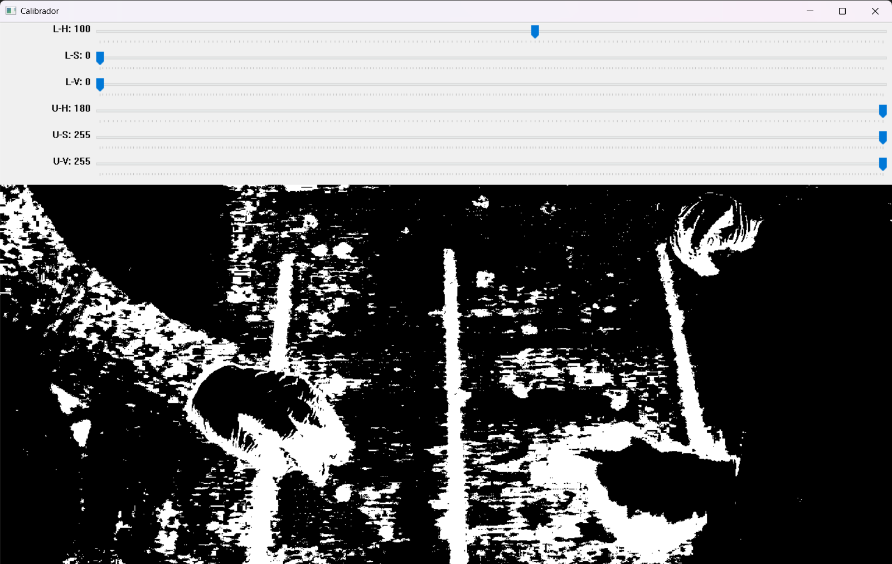
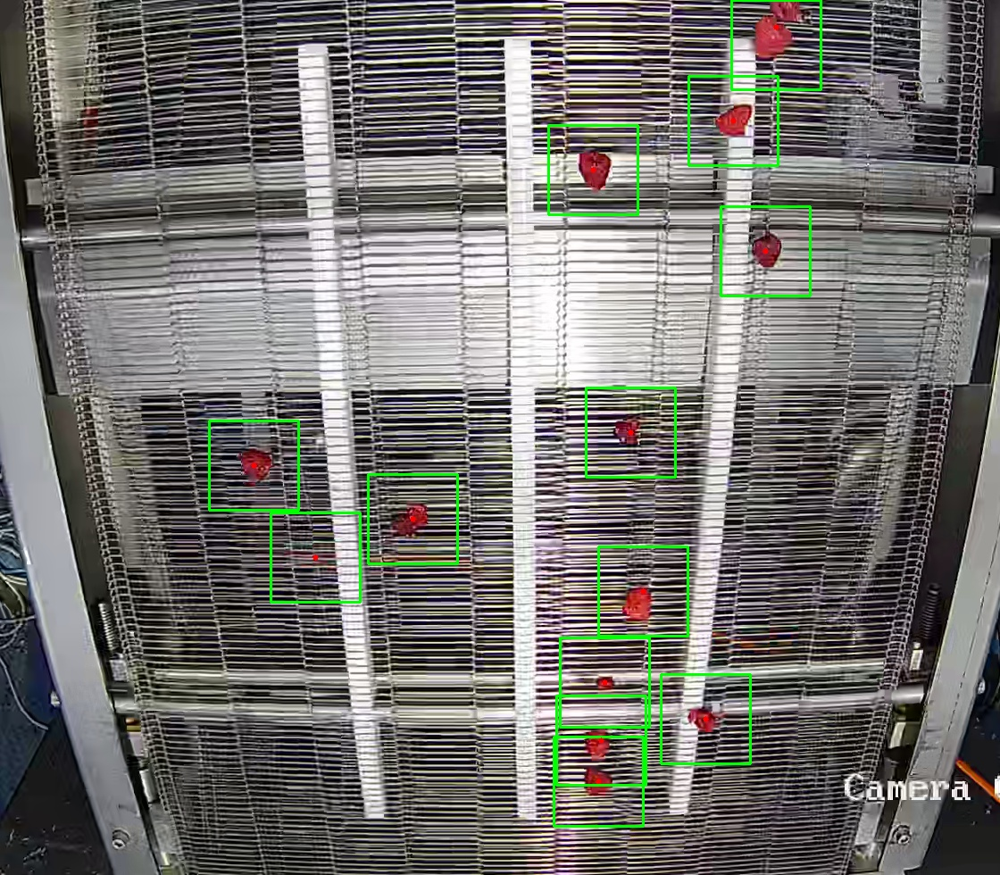
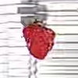

# Detección y Clasificación de Frambuesas en Líneas de Chocolatería Automatizada


## Descripción del Proyecto

Este proyecto aborda la automatización del control de calidad en la producción de **chocolatería fina e industrial**. El objetivo principal es desarrollar y evaluar una **Red Neuronal Convolucional (CNN)** para la clasificación binaria de frambuesas (*raspberries*) en tiempo real mientras avanzan por una cinta transportadora, justo antes de ingresar a la **cascada de bañado en chocolate**.

En este entorno de manufactura alimentaria, la detección temprana es crítica: encapsular una fruta defectuosa dentro de un bombón compromete la seguridad inocua del producto, genera gases de descomposición que rompen el templado del chocolate y arruina lotes completos de producción. 

El sistema inspecciona visualmente el flujo de fruta para clasificarlo en dos categorías:
* **Apta para Bañado (`Healthy`):** Frambuesas estructuralmente firmes, maduras y completamente limpias, capaces de resistir el peso y calor del chocolate fluido.
* **Rechazada (`Damaged / Rotten`):** Frambuesas que presentan aplastamiento, ablandamiento severo, o signos de putrefacción (como moho blanco o *Botrytis*), los cuales destruirían la calidad microbiológica y el sabor del producto final.


---

### Machine Vision

Para la primera etapa de detección de las frambuesas, se optó por un enfoque de Visión Computacional tradicional (Machine Vision) en lugar de un modelo YOLO debido a la complejidad de este último. 

El desarrollo del pipeline sigue estos pasos:
1. Se convierte el video original de la cinta del formato **BGR** al espacio de color **HSV** (Matiz, Saturación, Valor).
2. Se extraen los frames a conveniencia y se aplica una **máscara en blanco y negro** basada en el rango de color.
3. Se aplican **dos filtros morfológicos** para eliminar el ruido e imperfecciones de la máscara.
4. Con la máscara limpia, se detectan los contornos de las frambuesas y se recortan en imágenes individuales de **100 x 100 píxeles**, dejándolas listas para ser clasificadas por la red neuronal convolucional (CNN).


---

### Guía de Uso de los Códigos de Machine Vision

---

#### 1. `detecta_color.py`
Este script se utiliza para calibrar y encontrar los parámetros óptimos de la máscara HSV. Recibe como argumento la ruta de una imagen de prueba y despliega una ventana con barras de deslizamiento (*trackbars*). Esto permite ajustar dinámicamente los rangos de color hasta conseguir que las frambuesas se vean completamente blancas y el fondo negro.

**Ejemplo Visual:** 

**Comando de ejemplo:**
```bash
python detecta_color.py frambuesa.jpg
```
---
#### 2. `MV_boxes.py`
Este script permite previsualizar el comportamiento del algoritmo antes de realizar los recortes definitivos. Muestra la imagen original superponiendo recuadros verdes sobre las frambuesas detectadas.

Requiere 4 parametros obligatorios:

- `-v`: Ruta del video a procesar
- `-o`: Nombre de la carpeta de salida donde se guardan los resultados
- `-t`: Tiempo inicial (en segundos) por si se desea saltar a un momento especifico del video. (por defecto en 0)
- `-i`: Intervalo de tiempo (en segundos) entre la captura de cada frame

**Ejemplo Visual:** 

**Comando de Ejemplo:**
``` 
python MV_boxes.py -v video_frambuesas.mp4 -o frambuesas_cajas -t 30 -i 10
```

Nota: Importante los parametros de tiempo siempre estan en segundos, no acepta otras unidades.

---

#### 2. `MV_recortes.py`
Este script es el encargado de ejecutar la segmentación real. A diferencia de `MV_boxes.py`, este código recorta directamente cada frambuesa detectada en un formato cuadrado de 100x100 píxeles y las almacena en la carpeta seleccionada para armar el dataset. Utiliza los mismos parámetros que el script anterior.

**Ejemplo Visual:** 



Comando de Ejemplo:
```bash
python MV_recortes.py -v video_frambuesas.mp4 -o frambuesas_recortadas_100x100 -t 30 -i 10
```

